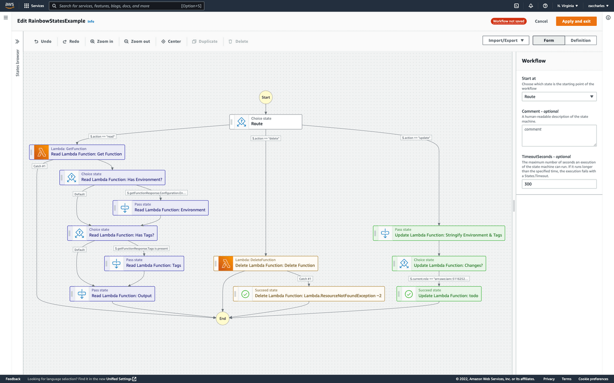

<h1 align="center">🌈 step-functions-rainbow-states</h1>

Browser extension to color AWS Step Functions states based on their prefix

 

  
   

 

  

## Description

Colors AWS Step Functions states in the Workflow Studio based on their prefix.  

For example, `Process Queue: Get Messages` and `Process Queue: Delete Messages` would be the same color.

## Motivation
State names must be unique within a Step Functions state machine. To avoid naming conflicts in larger state machines, it's common to prefix the names of related states (the CDK provides methods like [`prefixStates`](https://docs.aws.amazon.com/cdk/api/v1/docs/@aws-cdk_aws-stepfunctions.StateMachineFragment.html#prefixwbrstatesprefix) to make this easy).  

Larger state machines can be hard to visually navigate. Adding color helps distinguish one group of states from another.

## Features

 * Color states based on their name prefix (`"<prefix>: <name>"`)
 * Support for [AWS Step Functions Workflow Studio]

## Screenshot

## Install

|               |             |                  |                     |                  |            |
|:-----------------------------------------------------------------------------------------------------------:|:------------------------------------------------------------------------------------------------------------:|:-----------------------------------------------------------------------------------------------------------:|:-----------------------------------------------------------------------------------------------------------:|:-----------------------------------------------------------------------------------------------------------:|:-----------------------------------------------------------------------------------------------------------:|
| Chrome                                                                                                      | Firefox                                                                                                      | Opera                                                                                                       | Edge                                                                                                        | Brave                                                                                                       | Vivaldi                                                                                                     |
| [Download](https://github.com/zaccharles/step-functions-rainbow-states/releases/download/v0.0.2/chrome.zip) | [Download](https://github.com/zaccharles/step-functions-rainbow-states/releases/download/v0.0.2/firefox.zip) | [Download](https://github.com/zaccharles/step-functions-rainbow-states/releases/download/v0.0.2/chrome.zip) | [Download](https://github.com/zaccharles/step-functions-rainbow-states/releases/download/v0.0.2/chrome.zip) | [Download](https://github.com/zaccharles/step-functions-rainbow-states/releases/download/v0.0.2/chrome.zip) | [Download](https://github.com/zaccharles/step-functions-rainbow-states/releases/download/v0.0.2/chrome.zip) |
| (_Coming Soon_)                                                                            | [Install](https://addons.mozilla.org/addon/rainbow-states/)                                                                          | (_Coming Soon_)                                                                               | (_Coming Soon_)                                                                            | (_Coming Soon_)                                                                            | (_Coming Soon_)                                                                            |

## Bugs

Please file an issue [here](https://github.com/zaccharles/step-functions-rainbow-states/issues/new) for bugs, missing documentation, or unexpected behavior.

## Thanks

Extension template [web-extension-starter](https://github.com/zaccharles/step-functions-rainbow-states) by abhijithvijayan  
Rainbow icons created by [kosonicon - Flaticon](https://www.flaticon.com/free-icons/rainbow)

## License

GNU GPLv3 © [Zac Charles](https://twitter.com/zaccharles)
